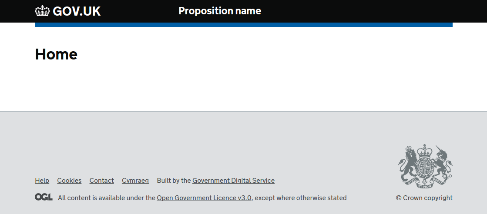
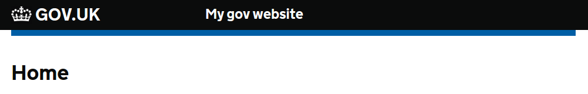
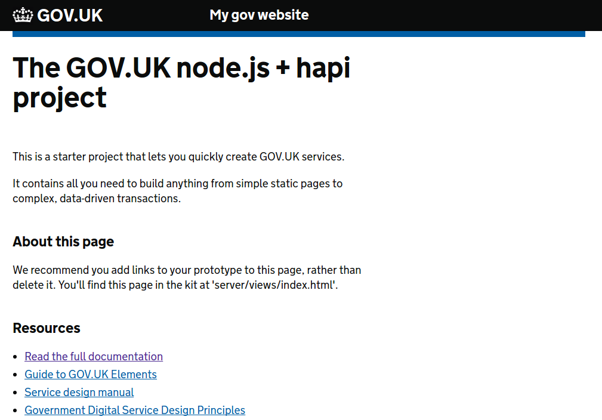
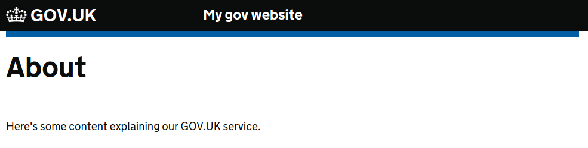

# Getting started

1. The easiest way to get started is to use the [scaffold.sh](scaffold.md) file.

2. Let's make a GOV.UK project called `my-gov` in the directory `~/dev`

  `$ dev/glupe-scaffold.sh gov my-gov`

2. Once you have the project scaffolded on the command line to start the server run:

  `npm start`

   This will start the server using `pm2` from the entry point of the application `index.js`.

3. Check the server is running by pointing your browser to `http://localhost:3002`, you should see this:

   

4. Now let's change the service name from "Proposition name". Using your text editor/IDE, open the `server/views/partials/propositionHeader.html` file. 

   ```html
   <div class="header-proposition">
     <div class="content">
       <nav id="proposition-menu">
         <a href="/" id="proposition-name">My gov website</a>
       </nav>
     </div>
   </div>
   ```

   Reload the page and the title should have changed.

   

5. Now let's change the home page content. Open the file `server/views/index.html` file and paste the following content:

   ```html
    <main id="content">
      <div class="grid-row">
        <div class="column-two-thirds">

          <h1 class="heading-xlarge">The GOV.UK <a href="https://nodejs.org/en/">Node.js</a> + <a href="http://hapijs.com/">hapi</a> project</h1>

          <p>
            This is a starter project that lets you quickly create GOV.UK services.
          </p>

          <p>
            It contains all you need to build anything from simple static pages to complex, data-driven transactions.
          </p>

          <h2 class="heading-medium">About this page</h2>

          <p>We recommend you add links to your prototype to this page, rather than delete it.
            You'll find this page in the kit at 'server/views/index.html'.</p>

          <h2 class="heading-medium">Resources</h2>

          <ul class="list list-bullet">
            <li><a href="https://github.com/davidjamesstone/glupe">
                Read the full documentation</a></li>
            <li>
              <a href="https://govuk-elements.herokuapp.com/snippets/">
                Guide to GOV.UK Elements
              </a>
            </li>
            <li>
              <a href="https://www.gov.uk/service-manual">
                Service design manual
              </a>
            </li>
            <li>
              <a href="https://www.gov.uk/design-principles">
                Government Digital Service Design Principles
              </a>
            </li>
          </ul>

        </div>
      </div>
    </main>
   ```
   Reload the page and the title should have changed.

   

6. Finally, let's add a new page. First open the `server/routes` folder and add a new file called `about.js` with this content:

   ```js
    module.exports = {
      method: 'GET',
      path: '/about',
      config: {
        handler: function (request, reply) {
          return reply.view('about')
        }
      }
    }   
   ```

   We need a view for our new page. Add an `about.html` file into the `server/views` directory.

   ```html
    <main id="content">
      <div class="grid-row">
        <div class="column-two-thirds">
          <h1 class="heading-xlarge">About</h1>
          <p>
            Here's some content explaining our GOV.UK service.
          </p>
        </div>
      </div>
    </main> 
   ```

   Finally to make sure the new route gets registered, add it to the `server/routes/index.js` file
   ```js
    module.exports = [
      require('./home'),
      require('./about'),
      require('./public')
    ]
   ```

   Now point your browser to `http://localhost:3002/about` and you should see the following:

   


### Read next  
[Configuration](config.md)  
[Server](server.md)  
[Client](client.md)  
[Linting](linting.md)  
[Logging](logging.md)  
[Manifest](manifest.md)  
[Routes](routes.md)  
[Statics](statics.md)  
[Tasks](tasks.md)  
[Views](views.md)  