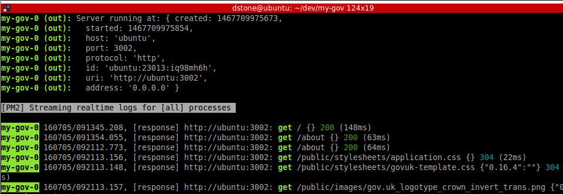
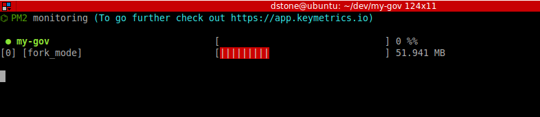
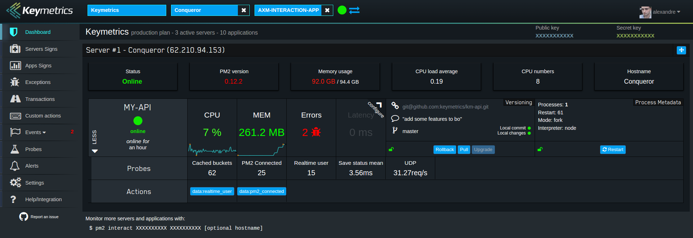

# Running the server

Once you have the project scaffolded on the command line to start the server run:

  `npm start`

This will start the server using [pm2](http://pm2.keymetrics.io/) from the entry point of the application `index.js` using the `config/pm2.json` config.

If you don't want to use `pm2`, you can simply use `node index.js`.

## PM2

PM2 is a process manager for Node.js. It has lot's of features. Here are some of the more common ones:

1. In development mode, the server auto reloads when code changes
2. In production mode, [Cluster Mode](http://pm2.keymetrics.io/docs/usage/cluster-mode/) allows Node.js applications to be scaled accross all CPUs available, without any modifications.
   Compared to a single instance setup, using the cluster mode can increase performance up to 650% on a 8 cores CPU.
3. [pm2 logs](http://pm2.keymetrics.io/docs/usage/log-management/#displaying-logs-in-real-time) - Displaying logs of a specified process or of all processes in real-time

   

4. [pm2 monit](http://pm2.keymetrics.io/docs/usage/monitoring/) - You can monitor memory and cpu very easily, straight from your terminal

   

5. `pm2 kill` - kills the current pm2

6. [Regsiter](https://app.keymetrics.io/#/register) - If you manage your Node.js app with PM2, Keymetrics makes it easy to monitor and manage your app online.

   

7. Click [here](http://pm2.keymetrics.io/docs/usage/pm2-doc-single-page/) for a full list of pm2 features